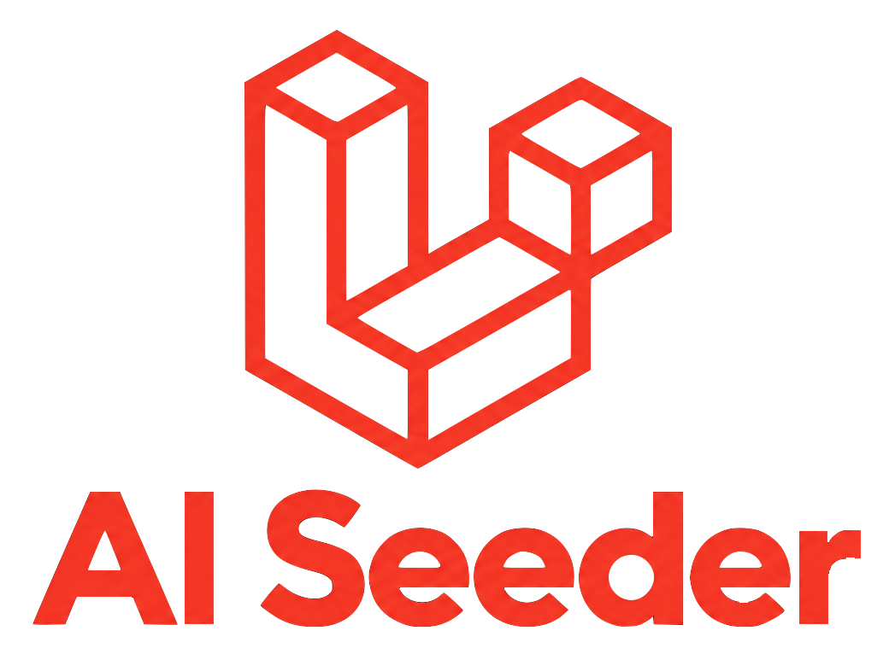

<p align="center"></p>

<p align="center">


</p>

## About AI Seeder

AI Seeder fills your database with realistic data written by an LLM. Describe an Eloquent model once in a small
definition class, and let the AI invent the parts that need imagination (names, blurbs, categories) while Faker and
plain values take care of everything else.

- **Hybrid fields.** Mix `Ai::*` fields, Faker closures and literals in the same definition. Only the AI fields are sent to the provider.
- **Any OpenAI-compatible provider.** OpenAI, or a local server such as Ollama, LM Studio or llama.cpp.
- **Fast and resilient.** Rows are requested in concurrent batches, with automatic retries and backoff.
- **Safe by default.** Every generated row is validated before it is inserted, and the rows of a model are written in a single transaction: all of them, or none.

## Installation

```bash
composer require vendor/ai-seeder
php artisan vendor:publish --tag=ai-seeder-config
```

Add your key to `.env`:

```dotenv
OPENAI_API_KEY=sk-...
```

## A Quick Look

Describe a model:

```php
namespace App\Seeding;

use Illuminate\Support\Str;
use Vendor\AiSeeder\Ai;
use Vendor\AiSeeder\AiModelDefinition;

class ProductDefinition extends AiModelDefinition
{
    public function context (): string
    {
        return 'an online shop selling outdoor gear';
    }

    public function fields (): array
    {
        return [
            'name' => Ai::text('product name'),
            'category' => Ai::enum(['tents', 'boots', 'packs']),
            'price' => Ai::float('price in EUR', 5, 500),
            'slug' => fn ($faker, array $row) => Str::slug($row['name']),
            'currency' => 'EUR',
        ];
    }
}
```

Register it in `config/ai-seeder.php`:

```php
'models' => [
    App\Models\Product::class => App\Seeding\ProductDefinition::class,
],
```

Seed it:

```bash
php artisan ai-seeder:seed Product --count=25
```

## Documentation

The full documentation lives in the [GitHub Wiki](../../wiki): installation, configuration, writing definitions,
seeding, how it works, troubleshooting and testing.

## Testing

```bash
vendor/bin/phpunit
```

The test suite needs no network access and no API key.

## Contributing

Contributions are welcome. For anything bigger than a small fix, please open an issue first to discuss it. Before
sending a pull request, make sure `vendor/bin/phpunit` and `vendor/bin/pint --test` both pass.

## Security Vulnerabilities

If you discover a security vulnerability, please report it privately through the repository's
[Security tab](../../security) instead of opening a public issue.

## License

AI Seeder is open-sourced software licensed under the [MIT license](https://opensource.org/licenses/MIT).
